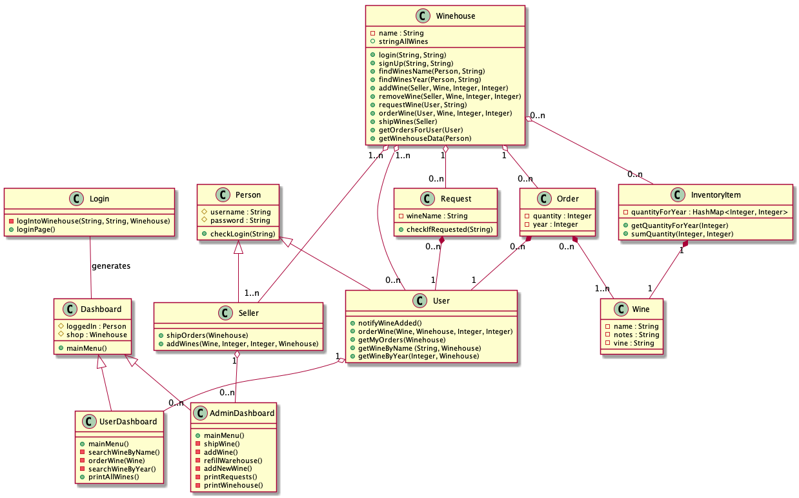
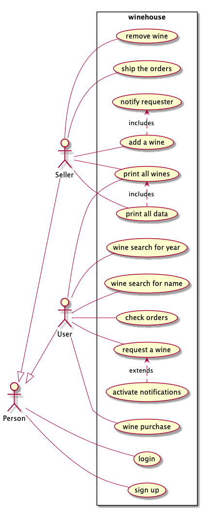

# Software Engineering Assignments

This repository contains the assigned exercises for the software engineering course @UniPR.

You can find assignments in the "assegnamenti" directory. 

Each project contains the required classes and a main. 

## Esercitazione 1

Here, we had to build a management system for a sports club. A requirement for the project was not using complex data sets, so we had to use simple arrays and copy them.  

The project is composed of 8 classes:

* `Activity` is a basic activity for the club. It has two specific subclasses:
  * `Race`, which is a competitive race
  * `Course`, which is a lesson teached at the club
* `Club` is the most important class. It contains all the data involved in the club's management, like members, admins, activities...
* `Helpers` is a helper class with methods made to cope with simple arrays. It provides useful solutions to the problems you might have using arrays instead of ArrayLists.
* `Person` is a club member, who cans subscribe to courses and races.
* `Admin` is a system manager, who can edit users, activities, etc...
* `App` is the class containing the main, used to test the project.

## Esercitazione 2

The second exercise's idea is based on the management of a Wine shop. Here, people can buy wine, request desired wines by name, or by year. The basic classes for the project are:

*  `Person`, representing a user of the system. It has two subclasses:
  * `Seller` is, obviously, a system manager. It can manage orders, ship them, manage requests.
  * `User` is a simple user, who can buy wine, search it, request it.
* `Wine` represents a wine type. 
* `InventoryItem` was made to cope with different years. It saves the various quantities for each year.
* `Request` contains a wine request made by a user.
* `Order` is an order made by a user, containing a wine. 
* `Winehouse` is the main class, containing all the shop's data.

To start a simple demo testing these classes, just use the main method contained in `Demo`.

### Interactivity

We wanted to spice things up a bit, so we added interactivity to the project. This required 6 additional classes:

* `Login` generates a dashboard for the logged in user.
* `Dashboard` is the class containing the required methods for interactivity. It has two subclasses:
  * `AdminDashboard` is the dashboard sellers use.
  * `UserDashboard` is the one used by users.

To test these features, just start the main method container in the `App` class.

### UML

To support the project's ideation process, we created two UML diagrams:

